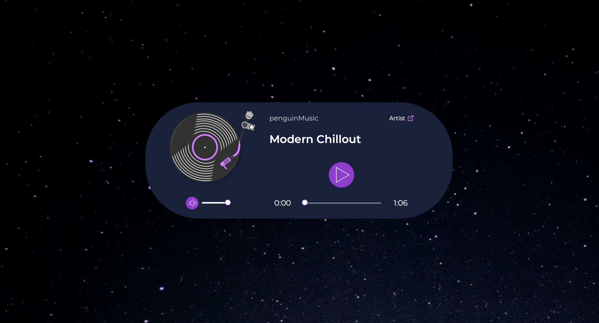

<div align="center">
  
</div>

## Table of contents

- [Overview](#overview)
  - [The challenge](#the-challenge)
  - [Links](#links)
- [My process](#my-process)
  - [Built with](#built-with)
  - [What I learned](#what-i-learned)
  <!--- [Continued development](#continued-development)
  - [Useful resources](#useful-resources)-->
- [Author](#author)

## Overview

### The challenge

While working on another project, I was designing a page section describing an audio library and thought an audio player that could play samples would be useful. I searched around, and while I found a lot of integration and pre-built options on offer, most either required a fee or included limits on plays, uploaded files, etc. 

Since I couldn't find anything that met my needs, I decided I'd build a custom audio player myself from scratch. 

I used HTML's built-in audio player using the `<audio>` element, customized it with CSS and JavaScript, and then turned it into a resusable web component using `<template>` and `<slot>`.

I wanted to keep it simple, so I decided on the following features:

- Play/pause button
- Volume adjustment with mute button
- Track duration and current time display
- Seek slider/progress bar

<!--<div align="center">
  
  
  <p><em><em></p>
</div>-->

### Links

- See it in the browser: [Custom JavaScript audio player](https://rileydevdzn.github.io/audio-player-web-component/)

## My process

### Built with

- Semantic HTML5 markup
- CSS
- JavaScript
- JSON animations from Lottiefiles and Icons8


### What I learned

1. Using animated icons for the play and mute buttons

I wanted to use a single button a user could click to pause or play the audio. There are a few ways to do this both functionally and visually; I chose to use JSON animations for my icons. I found a play/pause animation I liked on icons8, and a mute/unmute animation on Lottiefiles.

First, I imported the Lottie library from Skypack and set up my variables for each button and to store its current state. Then I used the Lottie `loadAnimation()` method to load the animation, setting its source path, format for render, and whether to loop and/or autoplay the animation.  

```js
import lottieWeb from 'https://cdn.skypack.dev/lottie-web';

const playBtnContainer = shadow.getElementById('play-icon');
const muteBtnContainer = shadow.getElementById('mute-icon');
let playState = 'play';
let muteState = 'unmute';
//rAF = request animation frame
let rAF = null;

const playAnimation = lottieWeb.loadAnimation({
    container: playBtnContainer,
    path: 'https://maxst.icons8.com/vue-static/landings/animated-icons/icons/pause/pause.json',
    renderer: 'svg',
    loop: false,
    autoplay: false,
    name: "Play Button Animation",
});
          
const muteAnimation = lottieWeb.loadAnimation({
    container: muteBtnContainer,
    path: 'https://maxst.icons8.com/vue-static/landings/animated-icons/icons/no-sound/no-sound.json',
    renderer: 'svg',
    loop: false,
    autoplay: false,
    name: "Mute Button Animation",
});
```

Next I included the `goToAndStop()` method to initially show the play state, then switch to the pause state on click. I then added an event listener to each of the buttons and specified which frames of the animation to play for each state. It took a bit of trial and error for the correct frame timing to get the exact look I was going for.

```js
playAnimation.goToAndStop(15, true);

playBtnContainer.addEventListener('click', () => {
    if(playState === 'play') {
        audio.play();
        playAnimation.playSegments([15, 27], true);
        requestAnimationFrame(whilePlaying);
        playState = 'pause';
    } else {
        audio.pause();
        playAnimation.playSegments([0, 15], true);
        cancelAnimationFrame(rAF);
        playState = 'play';
    }
});
        
muteBtnContainer.addEventListener('click', () => {
    if(muteState === 'unmute') {
        muteAnimation.playSegments([0, 17], true);
        audio.muted = true;
        muteState = 'mute';
    } else {
        muteAnimation.playSegments([17, 26], true);
        audio.muted = false;
        muteState = 'unmute';
    }
});
```

2. Calculating track duration and current time

In my `<audio>` element, I included the `preload="metadata"` attribute to instruct the browser to load the audio file metadata up front (if available), and then display the duration property from the HTMLAudioElement.

```html
<audio src="" preload="metadata"></audio>
```

(In the final build, the `src` attribute of the `<audio>` element is blank because I used the `data-src` attribute on my web component to specify the path.)

The duration property is calculated in seconds, so I created a function to convert the duration time into minutes and seconds, then created another function to display the result.

```js
const audio = shadow.querySelector('audio');

const calculateTime = (secs) => {
    const minutes = Math.floor(secs / 60);
    const seconds = Math.floor(secs % 60);
    const returnedSeconds = seconds < 10 ? `0${seconds}` : `${seconds}`;
    return `${minutes}:${returnedSeconds}`;
}
        
const displayDuration = () => {
    durationContainer.innerText = calculateTime(audio.duration);
}
```

<!--Current time is tied to seek slider/transition for next section-->

<!--3. Creating an interactive seek slider/progress bar-->


3. Turning my audio player into a web component

After building out all of the audio player's functionality, I decided I wanted to turn it into a reusable web component using `<template>` and `<slot>`.

I created slots for the audio track title and artist name, and added a `data-src` attribute to allow quick and easy customization.

```html
<audio-player data-src="https://github.com/rileydevdzn/audio-player-web-component/blob/main/penguinmusic-modern-chillout-future-calm-12641.mp3?raw=true">
    <span slot="artist-name">penguinMusic</span>
    <span slot="track-title">Modern Chillout</span>
</audio-player>
```

<!--Briefly discuss what it took to do this with JS...shadow DOM, creating/initializing the audio player, extending, etc. -->

<!--### Continued development


### Useful resources

- []()
- []()-->


## Author

- Frontend Mentor - [@rileydevdzn](https://www.frontendmentor.io/profile/rileydevdzn)
