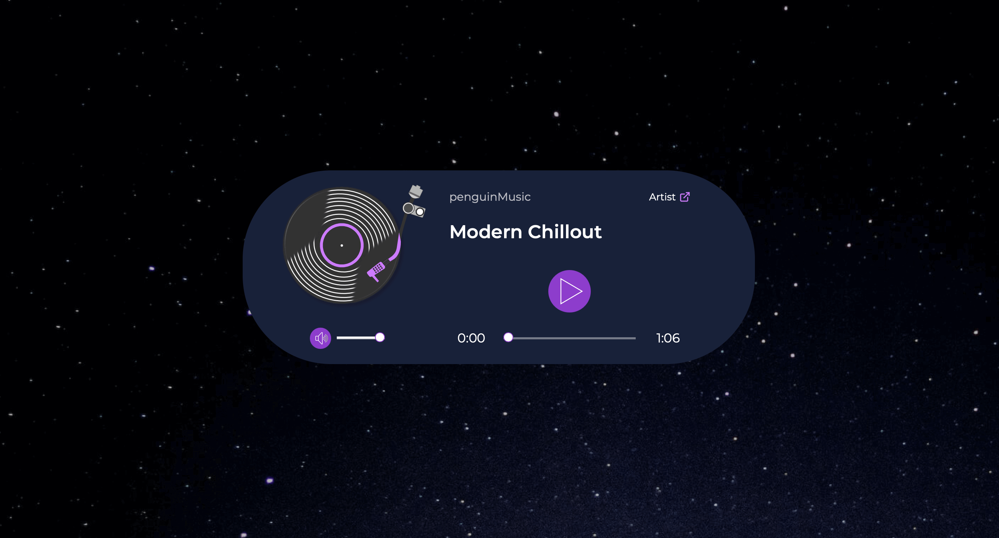
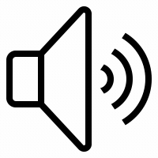
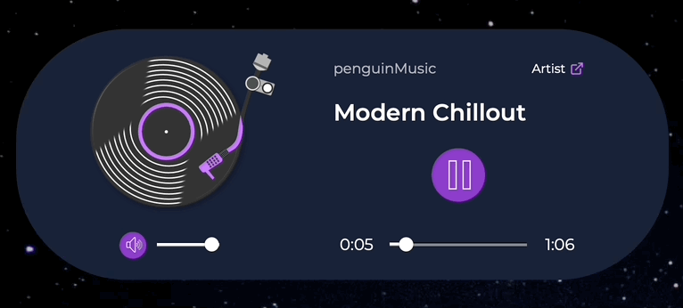

# Custom JavaScript Audio Player

<div align="center">
  
</div>

</br>

## Table of contents

- [Overview](#overview)
  - [Links](#links)  
  - [Highlights](#highlights)
- [Build details](#build-details)
  - [Features](#features)
  - [Challenges](#challenges)
  - [What I learned](#what-i-learned)
- [Author](#author)

</br>

## Overview

While working on another project, I was designing a page section describing an audio library and thought an audio player that could play sample tracks would be useful. I searched around, and while I found a lot of integrations and pre-built options on offer, most either required a fee or included limits on plays, uploaded files, etc. 

Since I couldn't find anything that met my needs, I decided I'd build a custom audio player myself from scratch. 

I used HTML's built-in audio player using the `<audio>` element, customized it with CSS and JavaScript, and then turned it into a resusable web component.

I wanted to keep it simple, so I decided on the following features:

- Play/pause button
- Volume adjustment with mute button
- Track duration and current time display with progress bar 

</br>

### Links

View live page: [Custom audio player](https://rileydevdzn.github.io/custom-audio-player/)

</br>

### Highlights

- JSON animations
  - [Animated icons for play and mute buttons](#animated-icons-for-play-and-mute-buttons)
- Seek slider 
  - [Integrated seek slider](#integrated-seek-slider)
- Reusable web component
  - [Creating a web component](#creating-a-web-component)

</br>

</br>

## Build details

### Features

#### *Animated icons for play and mute buttons*

For both the play and mute buttons, I needed to swap between two states, both visually and functionally. For example, the play icon should display when the audio is paused, and the pause icon should display when the audio is playing.

There are a couple different ways to do this, I chose to explore animated icons so I could work with JSON animations in this project.

Below are stills of each icon from the final build. Click on the collapsed section to see the animated versions. 

</br>

<div align="center">
  
  
  <p><em>Play button: play and pause icons</em></p>
</div>

</br>

<div align="center">
  
  
  <p><em>Mute button: unmute and mute icons</em></p>
</div>

</br>

<details>
<summary>See the animated versions from Icons8</summary>
</br>
</br>
<div align="center">
  <div align="center">
    
    <p><em>Animated play/pause icons for play button</em></p>
  </div>
  </br>
  <div align="center">
    
    <p><em>Animated unmute/mute icons for mute button</em></p>
  </div>
</div>
</details>

</br>

</br>

#### *Integrated seek slider*

In my first iteration of the design I used a simple progress bar along with the current time and duration displays. I added a seek slider to improve user control of the audio player, and I enjoyed the challenge of figuring out how to implement one.

Now a user can click or drag the slider handle anywhere along the range input and choose what starting point they want the audio to play from.

<div align="center">
    
    <p><em>Seek slider demo</em></p>
  </div>

</br>

#### *Creating a web component*

My original motivation for creating a custom audio player was to fulfill a need for one of my projects. And once I had created a single audio player, I wanted to explore web components so that I could create a reusable version if I wanted or needed multiple audio players on a page.

Since web components encapsulate their contents, separating them from the rest of the page, this was an easy way to create reusable code while avoiding the mess repeated declarations for the same element can create.

</br>

### Challenges

This project gave me an opportunity to try out new techniques and expand my JavaScript skills. Figuring out each piece of the puzzle – getting the JSON animations to play, retrieving metadata and updating the display times, integrating the seek slider and adjusting the volume controls – was its own unique challenge. Creating the web component and working with the shadow DOM was the most interesting part of the project for me and also the most satisfying.

*<small>The stylized record player image in the audio player is an SVG that I created with Figma as a side-challenge.</small>*

</br>

### What I learned

1. Using animated icons for the play and mute buttons

I wanted to use a single button a user could click to pause or play the audio. There are a few ways to do this both functionally and visually; I chose to use JSON animations for my icons. I found a play/pause animation and a mute/unmute animation on Icons8 I liked.

First, I imported the Lottie library from Skypack and set up my variables for each button and to store its current state. Then I used the Lottie `loadAnimation()` method to load the animation, setting its source path, format for render, and whether to loop and/or autoplay the animation.  

</br>
<details>
<summary>See the code</summary>

```js
import lottieWeb from 'https://cdn.skypack.dev/lottie-web';

const playBtnContainer = shadow.getElementById('play-btn');
const muteBtnContainer = shadow.getElementById('mute-btn');
let playState = 'play';
let muteState = 'unmute';
//rAF = request animation frame
let rAF = null;

const playAnimation = lottieWeb.loadAnimation({
    container: playBtnContainer,
    path: 'https://maxst.icons8.com/vue-static/landings/animated-icons/icons/pause/pause.json',
    renderer: 'svg',
    loop: false,
    autoplay: false,
    name: "Play Button Animation",
});
          
const muteAnimation = lottieWeb.loadAnimation({
    container: muteBtnContainer,
    path: 'https://maxst.icons8.com/vue-static/landings/animated-icons/icons/no-sound/no-sound.json',
    renderer: 'svg',
    loop: false,
    autoplay: false,
    name: "Mute Button Animation",
});
```
</details>
</br>

Next I included the `goToAndStop()` method to initially show the play state, then switch to the pause state on click. I then added an event listener to each of the buttons and specified which frames of the animation to play for each state. It took a bit of trial and error for the correct frame timing to get the exact look I was going for.

</br>
<details>
<summary>See the code</summary>

```js
playAnimation.goToAndStop(15, true);

playBtnContainer.addEventListener('click', () => {
    if(playState === 'play') {
        audio.play();
        playAnimation.playSegments([15, 27], true);
        requestAnimationFrame(whilePlaying);
        playState = 'pause';
    } else {
        audio.pause();
        playAnimation.playSegments([0, 15], true);
        cancelAnimationFrame(rAF);
        playState = 'play';
    }
});
        
muteBtnContainer.addEventListener('click', () => {
    if(muteState === 'unmute') {
        muteAnimation.playSegments([0, 17], true);
        audio.muted = true;
        muteState = 'mute';
    } else {
        muteAnimation.playSegments([17, 26], true);
        audio.muted = false;
        muteState = 'unmute';
    }
});
```

</details>
</br>

2. Calculating track duration

In my `<audio>` element, I included the `preload="metadata"` attribute to instruct the browser to load the audio file metadata up front (if available), and then display the duration property from the HTMLAudioElement.

```html
<audio src="" preload="metadata"></audio>
```

(In the final build, the `src` attribute of the `<audio>` element is blank because I used the `data-src` attribute on my `<audio-player>` custom element to specify the path.)

The duration property is calculated in seconds, so I created a function to convert the duration time into minutes and seconds, then created another function to display the result.

```js
const audio = shadow.querySelector('audio');

const calculateTime = (secs) => {
    const minutes = Math.floor(secs / 60);
    const seconds = Math.floor(secs % 60);
    const returnedSeconds = seconds < 10 ? `0${seconds}` : `${seconds}`;
    return `${minutes}:${returnedSeconds}`;
}
        
const displayDuration = () => {
    durationContainer.innerText = calculateTime(audio.duration);
}
```

</br>

3. Integrating seek slider with current time display

I used a range input for the seek slider. With a default max property of 100, I wanted to make sure the slider's handle (or 'thumb') reached the end of the slider when the audio ends, so I set the slider's max value equal to the audio's duration.

```js
const seekSlider = shadow.getElementById('seek-slider');

const setSliderMax = () => {
  seekSlider.max = Math.floor(audio.duration);
}
```

I could then add this function (along with display duration) into my conditional logic, checking the audio's state of readiness and loading the metadata if needed.

```js
if (audio.readyState > 0) {
    displayDuration();
    setSliderMax();
} else {
    audio.addEventListener('loadedmetadata', () => {
      displayDuration();
      setSliderMax();
    });
}
```

Next, I needed to update the current time, showing the playback position of the audio and updating this value both while the audio is playing and when a user drags the seek slider handle. To display this visually, I used the audio player variable `--seek-before-width` I defined with a default value of 0% that also updates based on the range's current value compared to its max value.

At the same time, I also needed to update the seek slider's value when the user drags the handle. I created a couple of functions to handle all of this, along with two event listeners: one for updating while the user was dragging the slider handle (input event) and a second to update after the user stopped (change event). 

</br>
<details>
<summary>See the code</summary>

```js
// While audio is playing, update seek slider, current time, rAF
const whilePlaying = () => {
  seekSlider.value = Math.floor(audio.currentTime);
  currentTimeContainer.innerText = calculateTime(seekSlider.value);
  audioPlayerContainer.style.setProperty('--seek-before-width', `${seekSlider.value / seekSlider.max * 100}%`);
  rAF = requestAnimationFrame(whilePlaying);
}
// Update sliders
const showRangeProgress = (rangeInput) => {
  if(rangeInput === seekSlider) audioPlayerContainer.style.setProperty('--seek-before-width', rangeInput.value / rangeInput.max * 100 + '%');
  else audioPlayerContainer.style.setProperty('--volume-before-width', rangeInput.value / rangeInput.max * 100 + '%');
}
// Event listener, Update progress bar and current time when using seek slider
seekSlider.addEventListener('input', (e) => {
  showRangeProgress(e.target);
  currentTimeContainer.textContent = calculateTime(seekSlider.value);
  if(!audio.paused) {
    cancelAnimationFrame(rAF);
  }
});
// Event listener, Update current time after done using seek slider
seekSlider.addEventListener('change', () => {
  audio.currentTime = seekSlider.value;
  if(!audio.paused) {
    requestAnimationFrame(whilePlaying);
  }
});
```

</details>
</br>

4. Turning the audio player into a web component

After building out all of the audio player's functionality, I decided I wanted to turn it into a reusable web component. 

I created a custom element `<audio-player>` and defined it using the browser APIs, encapsulated it using the shadow DOM and used HTML templates (`<template>` and `<slot>` elements) to create my resuable audio player.

**Defining the custom element**

```js
class AudioPlayer extends HTMLElement {
    constructor() {
        super();
        const player = document.querySelector('template');
        const playerContent = player.content;
        const shadow = this.attachShadow({mode: 'open'});
        shadow.appendChild(playerContent.cloneNode(true));
    }

    connectedCallback() {
        everything(this);
    }
}

customElements.define('audio-player', AudioPlayer);
```

**Working with the shadow DOM**

```js
const everything = function(element) {  
  const shadow = element.shadowRoot;

    const audioPlayerContainer = shadow.getElementById('audio-player');
    let rAF = null;
    // ...
    const audio = shadow.querySelector('audio');
    audio.src = element.getAttribute('data-src');
    // the rest of my variables and functions also included inside here
}

customElements.define('audio-player', AudioPlayer);
```

**Using HTML templates**

```html
<audio-player data-src="https://github.com/rileydevdzn/custom-audio-player/blob/main/penguinmusic-modern-chillout-future-calm-12641.mp3?raw=true">
  <span slot="artist-name">penguinMusic</span>
  <span slot="track-title">Modern Chillout</span>
</audio-player>
```

I created slots for the audio track title and artist name, and added a `data-src` attribute to allow quick and easy customization.

</br>

### Continued development

Now that I've created an audio player web component, my next challenge will be integrating the web component into one of my Webflow CMS projects.

</br>

## Author

- Riley - [View Portfolio](https://rileydevdzn.webflow.io)


<!-- Icon links
play/pause icon: https://icons8.com/free-animated-icons/pause
unmute/mute icon: https://icons8.com/free-animated-icons/no-sound
-->